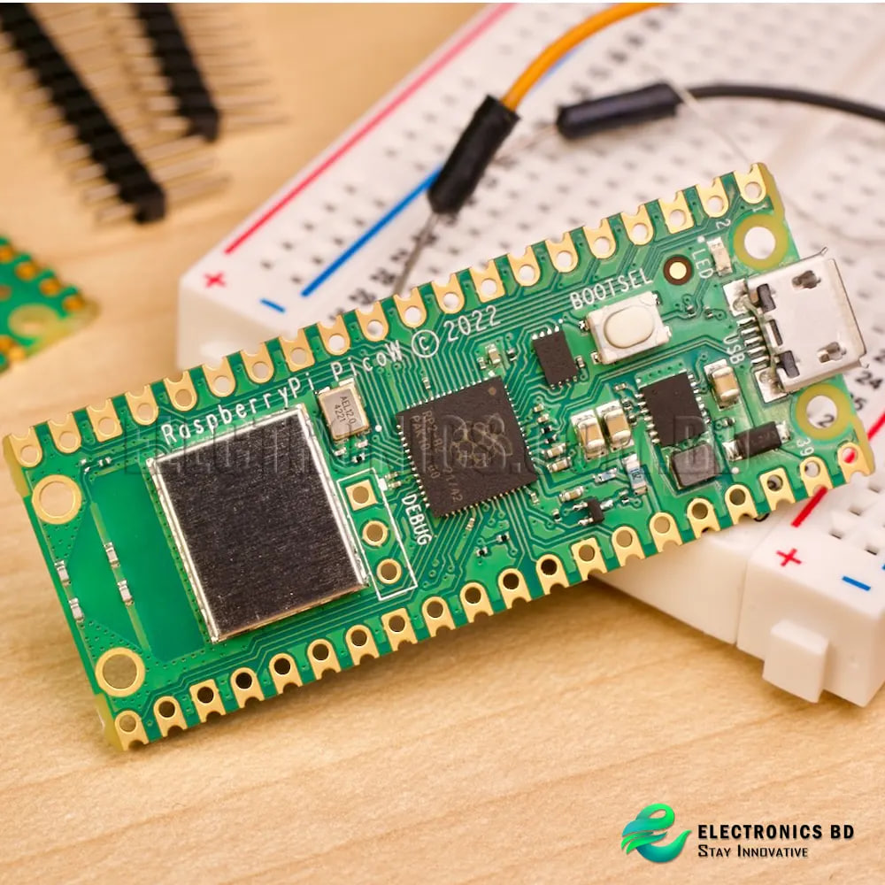

# wake-on-lan-server
 wake-on-lan-server

a simple wake on lan server on raspberry pi pico w that hosts a telegram bot to turn on a pc connected to same wifi network via LAN port. Wake on lan service must be enabled on BIOS hardware.




```
sudo apt-get install wakeonlan -y
```

/etc/systemd/system/wol.service

```
sudo systemctl enable wol.service
```
```
wakeonlan A0-36-BC-BD-08-2B
```
